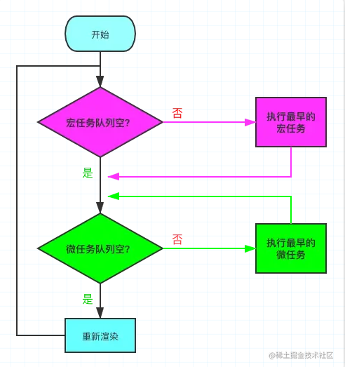

# 九、手写Promise

[参考文章](https://juejin.cn/post/6945319439772434469)

1. Promise 是一个类，在执行这个类的时候会传入一个执行器，这个执行器会立即执行
2. Promise 会有三种状态
   - Pending 等待
   - Fulfilled 完成
   - Rejected 失败
3. 状态只能由 Pending --> Fulfilled 或者 Pending --> Rejected，且一但发生改变便不可二次修改；
4. Promise 中使用 resolve 和 reject 两个函数来更改状态；
5. then 方法内部做但事情就是状态判断
   - 如果状态是成功，调用成功回调函数
   - 如果状态是失败，调用失败回调函数

## 1.什么是宏任务与微任务

Js 是单线程都，但是一些高耗时操作就带来了进程阻塞问题

为了解决这个问题，Js 有两种任务的执行模式：**同步模式（Synchronous）和 异步模式（Asynchronous）**

在异步模式下，创建异步任务主要分为**宏任务**与**微任务**两种。

ES6 规范中，<strong style="color:#DD5145">宏任务（Macrotask） 称为 Task， 微任务（Microtask） 称为 Jobs。</strong>

宏任务是**由宿主（浏览器、Node）发起的**，而微任务**由 JS 自身发起**。

| 宏任务（Macrotask）         | 微任务（Microtask）                      |
| --------------------------- | ---------------------------------------- |
| **`setTimeout`**            | requestAnimationFrame（有争议）          |
| **`setInterval`**           | MutationObserver（浏览器环境）           |
| postMessage、MessageChannel | **`Promise.[then/catch/finally]`**       |
| I/O，事件队列               | process.nextTick（Node环境）             |
| setImmediate（Node环境）    | queueMicrotask                           |
| script（整体代码块）        | Object.observe（已废弃；Proxy 对象替代） |

**如何理解 script（整体代码块）是个宏任务呢**

实际上如果同时存在两个 script 代码块，会首先在执行第一个 script 代码块中的同步代码，如果这个过程中创建了微任务并进入了微任务队列，第一个 script 同步代码执行完之后，会首先去清空微任务队列，再去开启第二个 script 代码块的执行。所以这里应该就可以理解 script（整体代码块）为什么会是宏任务。

## 2.什么是 EventLoop

1. 判断宏任务队列是否为空
   - 不空 --> 执行最早进入队列的任务 --> 执行下一步
   - 空 --> 执行下一步
2. 判断微任务队列是否为空
   - 不空 --> 执行最早进入队列的任务 --> **继续检查微任务队列空不空**
   - 空 --> 执行下一步

因为首次执行宏队列中会有 script（整体代码块）任务，所以实际上就是 Js 解析完成后，在异步任务中，会先执行完所有的微任务

需要注意的是，新创建的微任务会**立即进入微任务队列排队执行**，不需要等待下一次轮回

## 3.什么是 Promise A+ 规范

检验一份手写 Promise 靠不靠谱，通过 Promise A+ 规范自然是基本要求，这里我们可以借助 [promises-aplus-tests](https://link.juejin.cn/?target=https%3A%2F%2Fwww.npmjs.com%2Fpackage%2Fpromises-aplus-tests) 来检测我们的代码是否符合规范。

## 面试题

[45道面试题](https://juejin.cn/post/6844904077537574919)