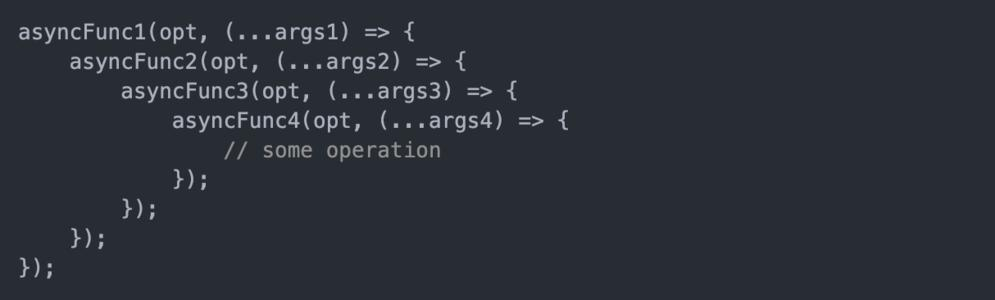
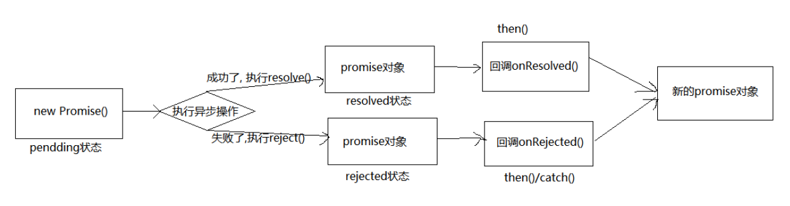

# Promise 介绍

## Promise 是什么？

**抽象表达：**

> - Promise 是一门新的技术（ES6 规范）
>
> - Promise 是 JS 中进行异步编程的 **新解决方案**
>
>   备注：旧方案是单纯使用回调函数

**具体表达：**

> - 从语法上来说：**Promise对象** 是一个**构造函数**
> - 从功能上来说：**Promise对象** 用来 <strong style="color:#DD5145">封装一个异步操作并可以获取其 成功 / 失败 的结果值</strong>

## 为什么要用 Promise？

**1. 指定回调函数的方式更加灵活**

> - 旧方案：必须在启动异步任务前指定
> - promise：启动异步任务 => 返回 promise 对象 => 给 promise对象绑定回调函数（可以在异步任务结束后指定多个）

**2. 支持链式调用，可以解决回调地狱问题**

回调地狱：

> 定义：回调函数嵌套使用，外部回调函数异步执行的结果是嵌套的回调执行的条件
>
> 缺点：不便于阅读，不便于异常处理
>
> 解决方案：**promise 链式调用**
>
> 终极解决方案：**promise + async / await**



## Promise 的状态

一个 Promise 必然处于以下几种状态之一：

> - 实例对象中的一个属性 对象的状态：**【PromiseState】**
>
>   - 待定 **pending**：初始状态，既没有被兑现，也没有被拒绝
>   - 已兑现 **resolved** 或 **fulfilled**：意味着操作 **成功**
>   - 已拒绝 **rejected**：意味着操作 **失败**
>
> - 实例对象中的另一个属性 对象结果值：**【PromiseResult】**
>
>   保存着对象 **成功 / 失败** 的结果
>
>   - resolved
>   - rejected

Promised 的状态改变：

> - 从 **pending** 变为 **resolved（fulfilled）**
>
> - 从 **pending** 变为 **rejected**
>
>   说明：只有这 2 种，且一个 promise对象只能改变一次，无论成功或失败，都会有一个结果数据，成功的结果数据为 **value**，失败为 **reason**

## Promise 的基本流程



## Promise 的基本使用

### Promise的使用

> Promise对象是一个构造函数，用来生成 Promise实例，创造 promise实例后，它会**立即执行**
>
> Promise 构造函数： **new Promise ( (resolve, reject) => { } )**

```javascript
let p = new Promise(function (resolve, reject) {
    // 使用 setTimeout 模拟请求数据库数据操作
    setTimeout(function () {
        let isRight = true	// 这个异步请求数据库数据操作是否正确返回数据
        if (isRight) {
            let data = '数据库中的数据'
            resolve(data)	// 设置 Promise 对象的状态为操作成功
        } else {
            let err = '数据读取失败！'
            reject(err) 	// 设置 Promise 对象的状态为操作失败
        }
    }, 1000)
})

// 调用 then
p.then(value => {
    console.log(value.toString())
}, reason => {
    console.log(reason)
})
```

### Promise封装读取文件

```javascript
// 使用 nodejs 的 fs 读取文件模块
const fs = require('fs');

const p = new Promise(function (resolve, reject) {
    fs.readFile('./resources/为学.txt', (err, data) => {
        if (err) reject(err);	// err是一个异常对象
        resolve(data);
    })
})

// 调用 then
p.then(value => {
    console.log(value.toString()) 	// 转为字符串输出
}, reason => {
    console.log(reason)
})
```

### Promise封装Ajax请求

```javascript
const p = new Promise((resolve, reject) => {
    const xhr = new XMLHttpRequest();
    xhr.open('get', 'https://api.apiopen.top/getJoke');
    xhr.send();
    xhr.onreadystatechange = function () {
        if (xhr.readyState === 4) {
            if (xhr.status >= 200 && xhr.status < 300) {
                resolve(xhr.response);	// 成功
            } else {
                reject(xhr.status);	// 失败
            }
        }
    }
});

// 调用 then
p.then(value => {
    console.log(value.toString())
}, reason => {
    console.log(reason)
})
```

### util.promise方法

> 可以将函数直接变成 promise 的封装方式，不用再去手动封装

```javascript
// 引入 util 模块
const util = require('util');
// 引入 fs 模块
const fs = require('fs');
// 返回一个新的函数
let mineReadFile = util.promisify(fs.readFile);

mineReadFile('./resource/content.txt').then(value => {
	console.log(value.toString());
});
```
