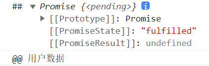
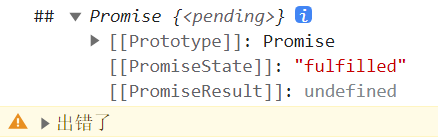

# 二、Promise API

Promise是一个构造函数，其自身有resolve，reject，race，all 等方法，而其原型上则有catch、finally、then等方法

- <strong style="color:#DD5145">动态方法</strong>：也叫做<strong style="color:#DD5145">实例（原型）方法</strong>，它是通过 prototype 原型对象添加的，所有的实例对象都能够继承调用。

  通过先定义一个引用变量，指向构造函数定义的新对象，对象中的属性 prototype 可以想成一个指针，指向一个方法。

- <strong style="color:#DD5145">静态方法</strong>：在构造函数本身上定义的方法，只能通过构造函数本身调用，new出来的对象不能够调用。

  静态方法直接用 **类名.方法名** 去调用。


## 1.Promise 的原型（实例）方法

属于new Promsie的API


### 1.1 Promise 构造函数

Promise 构造函数：**`Promise(executor) {}`**

- **executor** 函数：执行器 **`(resolve, reject) => {}`**
- **resolve** 函数：内部定义成功时，调用的函数是 **`value => {}`**
- **reject** 函数：内部定义失败时，调用的函数 **`reason => {}`**

```js
new Promise(executor)
```

说明：**executor 会在 Promise 内部立即同步调用（立即执行），异步操作在执行器中执行**。

<strong style="color:#DD5145">reject 是用来抛出异常的，catch 是用来处理异常的。</strong>


### 1.2 Promise.prototype.then 方法

`Promise.prototype.then` 方法返回的是一个**新 Promise对象**，该对象状态由**回调函数的执行结果**决定。

```js
then(onResolved)
then(onResolved, onRejected)
```

- **onResolved** 函数：成功的回调函数 **`value => {}`** 
- **onRejected** 函数：失败的回调函数 **`reason => {}`** 

<strong style="color:#DD5145">Promise 本身是同步，但是 Promise 的回调 then 和 catch 是异步的。</strong> 

```javascript
const p = new Promise((resolve, reject) => {
    setTimeout(() => {
        // resolve('用户数据')
        reject('出错了')
    }, 1000)
})
// 未设定返回值
const res = p.then(value => {
    console.log('@@', value)
}, reason => {
    console.warn(reason)
})
// 打印 then 方法的返回值
console.log('##', res)
```

输入的结果：

输出的结果：


###  1.3 then 方法的规则

- `.then`方法下一次的输入需要上一个回调函数返回的值
- 如果一个 promise 执行完后 返回的还是一个 promise，会把这个 promise 的执行结果，传递给下一次`then`中
- 如果`then`中返回的不是 promise 对象而是一个普通值，则会将这个结果作为下次 then 的成功的结果
- 如果当前`then`中失败了 会走下一个`then`的失败
- 如果返回的是 undefined 不管当前是成功还是失败 都会走下一次的成功
- `catch`是错误没有处理的情况下才会走
- `then`中不写方法则值会**穿透**，传入下一个`then`中


### 1.4 Promise.prototype.catch方法

`Promise.prototype.catch`方法：就是一个语法糖，只接收一个参数。

```js
p.catch(onRejected)
```

- **onRejected** 函数：失败的回调函数 (reason) => { }

说明：then() 的语法糖, 相当于：**`then(undefined, onRejected)`**

> **Promise 对象的错误具有“冒泡”性质，会一直向后传递，直到被捕获为止**，即 错误总是会被下一个catch 捕获。
>
> then 里面第二个参数捕捉错误只能捕捉上级的，不能捕捉同级的第一个参数里的错误，所以要用 **catch**。

```javascript
let p = new Promise((resolve, reject) => {
    reject('error');
});
p.catch(reason => {
    console.log(reason);
});
```

我们可以用三种方式拦截 rejected 状态的 promise，分别是：

- 使用 then 的第二个参数
- 使用 catch 方法捕获前方 promise 抛出的异常
- 使用 try catch 拦截 promise 抛出的异常。


### 1.5 Promise.prototype.finally方法

不管 Promise 对象最后状态如何都会执行的函数

```javascript
promise.then(result => {···})
    .catch(error => {···})
    .finally(() => {···})
```


## 2.Promise 的静态方法

不属于new Promise的API

### 2.1 Promise.resolve

Promise.resolve 方法：**(value) => { }** 

- value：成功的数据 或 promise 对象
- 返回一个成功/失败的 promise 对象

resolve( ) 方法将现有对象转换成 Promise 对象，该实例的状态为 fulfilled。

```javascript
let p1 = Promise.resolve('chenglun17')  // 返回成功的Promise
let p2 = Promise.resolve(new Promise((resolve, reject) => {
	// resolve('ok')
	reject('error')  // 错误的结果需要catch捕获否则报错
}))

console.log(p1) // 返回 Promise {<fulfilled>: 'chenglun17'}
console.log(p2) // 返回 Promise {<rejected>: 'error'}

p2.catch(reason =>{
	console.log('##', reason) // 返回 ## error
})
```

+ 如果传入的参数为<strong style="color:#DD5145">非Promise类型的对象</strong>，则返回的结果永远为<strong style="color:#DD5145">成功</strong>的 Promise对象
+ 如果传入的参数为 <strong style="color:#DD5145">Promise对象</strong>，则 <strong style="color:#DD5145">该Promise对象的状态</strong>决定了 p2 执行 resolve 还是 rejected


### 2.2 Promise.reject

**Promise.reject 方法**：**(reason) => { }** 

- reason：失败的原因
- 返回一个失败的 promise 对象

reject( ) 方法返回一个新的Promise实例，该实例的状态为rejected

```javascript
let p1 = Promise.reject('chenglun17')
let p2 = Promise.reject(new Promise((resolve, reject) => {
    resolve('ok')
    // reject('error')
}))

console.log(p1)
console.log(p2)
```

- 如果传入的参数为<strong style="color:#DD5145">非Promise类型的对象</strong>，则返回的结果永远为<strong style="color:#DD5145">失败</strong>的 Promise对象
- 如果传入的参数为 <strong style="color:#DD5145">Promise对象</strong>，则 <strong style="color:#DD5145">该Promise对象的状态</strong>决定了 p2 执行 resolve 还是 rejected


### 2.3 Promise.all

**Promise.all 方法**：**(promises) => { }**

- promises：包含 n 个 promise 的数组
- **`all()`** 方法提供了并行执行异步操作的能力，并且再所有异步操作执行完后才执行回调

说明：<strong style="color:#DD5145">用于将多个 Promise 实例，包装成一个新的 Promise 对象</strong>，只有所有的 promise 都成功才成功，只要有一个失败了就直接失败。

```javascript
let p1 = new Promise((resolve ,reject) =>{
	resolve("ok")
})
let p2 = Promise.resolve("Sucess")
let p3 = Promise.reject("zimo")  // 有一个失败

const result = Promise.all([p1,p2,p3])
console.log(result)  // 结果为失败
```


### 2.4 Promise.race

**Promise.race 方法**：`(promises) => {}`

- promises：包含 n 个 promise 的数组

说明：返回一个新的 promise, **第一个完成的 promise 的结果状态 **就是最终的结果状态。

比如，同时向两个URL读取用户的个人信息，只需要获得先返回的结果即可。这种情况下，用 Promise.race() 实现。

```javascript
let p1 = new Promise((resolve ,reject) =>{
    setTimeout(()=>{
        reject("ok") // 等待一秒执行reject
    },1000)
})
let p2 = Promise.resolve("Sucess")  // 最先执行p2
let p3 = Promise.resolve("zimo")

const result = Promise.race([p1,p2,p3])
console.log(result);
```


## 参考

[参考文章](https://blog.csdn.net/qiuqiula_/article/details/100138750)