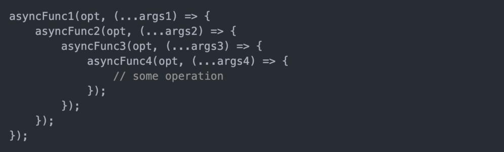

# Promise 介绍

## Promise 是什么？

**抽象表达：**

> - Promise 是一门新的技术（ES6 规范）
>
> - Promise 是 JS 中进行异步编程的 **新解决方案**
>
>   备注：旧方案是单纯使用回调函数
>   

**具体表达：**

> - 从语法上来说：**Promise对象** 是一个**构造函数**
> - 从功能上来说：**Promise对象** 用来 <strong style="color:#DD5145">封装一个异步操作并可以获取其 成功 / 失败 的结果值</strong>

## 为什么要用 Promise？

**1. 指定回调函数的方式更加灵活**

> - 旧方案：必须在启动异步任务前指定
> - promise：启动异步任务 => 返回 promise 对象 => 给 promise对象绑定回调函数（可以在异步任务结束后指定多个）

**2. 支持链式调用，可以解决回调地狱问题**

回调地狱：

> 定义：回调函数嵌套使用，外部回调函数异步执行的结果是嵌套的回调执行的条件
>
> 缺点：不便于阅读，不便于异常处理
>
> 解决方案：**promise 链式调用**
>
> 终极解决方案：**promise + async / await**



## Promise 的状态

一个 Promise 必然处于以下几种状态之一：

> - 实例对象中的一个属性 对象的状态：**【PromiseState】**
>   - 待定 **pending**：初始状态，既没有被兑现，也没有被拒绝
>   - 已兑现 **resolved** 或 **fulfilled**：意味着操作 **成功**
>   - 已拒绝 **rejected**：意味着操作 **失败**
>
> - 实例对象中的另一个属性 对象结果值：**【PromiseResult】**
>
>   保存着对象 **成功 / 失败** 的结果
>
>   - resolved
>   - rejected

Promised 的状态改变：

> - 从 **pending** 变为 **resolved（fulfilled）**
>
> - 从 **pending** 变为 **rejected**
>
>   说明：只有这 2 种，且一个 promise对象只能改变一次，无论成功或失败，都会有一个结果数据，成功的结果数据为 **value**，失败为 **reason**

## Promise 的基本流程


## Promise 的基本使用

### Promise的使用

> Promise对象是一个构造函数，用来生成 Promise实例，创造 promise实例后，它会**立即执行**
>
> Promise 构造函数： **new Promise ( (resolve, reject) => { } )**

```javascript
let p = new Promise(function (resolve, reject) {
    // 使用 setTimeout 模拟请求数据库数据操作
    setTimeout(function () {
        let isRight = true	// 这个异步请求数据库数据操作是否正确返回数据
        if (isRight) {
            let data = '数据库中的数据'
            resolve(data)	// 设置 Promise 对象的状态为操作成功
        } else {
            let err = '数据读取失败！'
            reject(err) 	// 设置 Promise 对象的状态为操作失败
        }
    }, 1000)
})

// 调用 then
p.then(value => {
    console.log(value.toString())
}, reason => {
    console.log(reason)
})
```

### Promise封装读取文件

```javascript
// 使用 nodejs 的 fs 读取文件模块
const fs = require('fs');

const p = new Promise(function (resolve, reject) {
    fs.readFile('./resources/为学.txt', (err, data) => {
        if (err) reject(err);	// err是一个异常对象
        resolve(data);
    })
})

// 调用 then
p.then(value => {
    console.log(value.toString()) 	// 转为字符串输出
}, reason => {
    console.log(reason)
})
```


### Promise封装Ajax请求

```javascript
const p = new Promise((resolve, reject) => {
    const xhr = new XMLHttpRequest();
    xhr.open('get', 'https://api.apiopen.top/getJoke');
    xhr.send();
    xhr.onreadystatechange = function () {
        if (xhr.readyState === 4) {
            if (xhr.status >= 200 && xhr.status < 300) {
                resolve(xhr.response);	// 成功
            } else {
                reject(xhr.status);	// 失败
            }
        }
    }
});

// 调用 then
p.then(value => {
    console.log(value.toString())
}, reason => {
    console.log(reason)
})
```


### util.promise方法

> 可以将函数直接变成 promise 的封装方式，不用再去手动封装

```javascript
// 引入 util 模块
const util = require('util');
// 引入 fs 模块
const fs = require('fs');
// 返回一个新的函数
let mineReadFile = util.promisify(fs.readFile);

mineReadFile('./resource/content.txt').then(value => {
	console.log(value.toString());
});
```

# Promise API

Promise是一个构造函数，其自身有resolve，reject，race，all等方法，而其原型上则有catch、finally、then等方法

> - <strong style="color:#DD5145">动态方法</strong>：也叫做<strong style="color:#DD5145">实例（原型）方法</strong>，它是通过prototype原型对象添加的，所有的实例对象都能够继承调用。通过先定义一个引用变量，指向构造函数定义的新对象，数对象中的属性 prototype可以想成一个指针，指向一个方法。
>
> - <strong style="color:#DD5145">静态方法</strong>：在构造函数本身上定义的方法，只能通过构造函数本身调用，new出来的对象不能够调用。
>
>   静态方法直接用 **类名.方法名** 去调用。
>
> [参考文章](https://blog.csdn.net/qiuqiula_/article/details/100138750)

## Promise 的原型（实例）方法

属于new Promsie的API

### Promise 构造函数

Promise 构造函数：**`Promise(executor) {}`**

> - **executor** 函数：执行器 **`(resolve, reject) => {}`**
>- **resolve** 函数：内部定义成功时，调用的函数是 **`value => {}`**
> - **reject** 函数：内部定义失败时，调用的函数 **`reason => {}`**
>
> 说明：**executor 会在 Promise 内部立即同步调用（立即执行），异步操作在执行器中执行**

> reject 是用来抛出异常的，catch 是用来处理异常的

### Promise.prototype.then 方法

`Promise.prototype.then` 方法返回的是一个**新 Promise对象**，该对象状态由**回调函数的执行结果**决定

> 参数：
>
> - **onResolved** 函数：成功的回调函数 **`value => {}`**
> - **onRejected** 函数：失败的回调函数 **`reason => {}`**
>

> promise是同步执行，**then是异步执行**
>
> promise本身不是异步的，只是内部包含了异步代码。

```javascript
const p = new Promise((resolve, reject) => {
    setTimeout(() => {
        // resolve('用户数据')
        reject('出错了');
    }, 1000);
})
// 未设定返回值
const res = p.then(value => {
    console.log(value);
}, reason => {
    console.warn(reason);
})
// 打印 then 方法的返回值
console.log(res);
```

###  then方法的规则

- `then`方法下一次的输入需要上一次的输出
- 如果一个promise执行完后 返回的还是一个promise，会把这个promise 的执行结果，传递给下一次`then`中
- 如果`then`中返回的不是Promise对象而是一个普通值，则会将这个结果作为下次then的成功的结果
- 如果当前`then`中失败了 会走下一个`then`的失败
- 如果返回的是 undefined 不管当前是成功还是失败 都会走下一次的成功
- catch是错误没有处理的情况下才会走
- `then`中不写方法则值会**穿透**，传入下一个`then`中


### Promise.prototype.catch方法

**Promise.prototype.catch 方法**：就是一个语法糖，只接收一个参数

> 参数：**onRejected** 函数：失败的回调函数 **(reason) => { }**
>
> 说明：then() 的语法糖, 相当于：**`then(undefined, onRejected)`**

> **Promise 对象的错误具有“冒泡”性质，会一直向后传递，直到被捕获为止**，即 错误总是会被下一个catch 捕获
>
> then 里面第二个参数捕捉错误只能捕捉上级的，不能捕捉同级的第一个参数里的错误，所以要用 **catch**

```javascript
let p = new Promise((resolve, reject) => {
    reject('error');
});
p.catch(reason => {
    console.log(reason);
});
```

我们可以用三种方式拦截 rejected状态的 promise，分别是：

> - 使用 then 的第二个参数
> - 使用 catch 方法捕获前方 promise 抛出的异常
> - 使用 try catch 拦截 promise 抛出的异常。

### Promise.prototype.finally方法

不管Promise对象最后状态如何都会执行的函数

```javascript
promise.then(result => {···}).catch(error => {···}).finally(() => {···});
```


## Promise的静态方法

不属于new Promise的API

### Promise.resolve

**Promise.resolve 方法**：**(value) => { }**

> value：**成功的数据** 或 **promise 对象**
>
> resolve( ) 方法将现有对象转换成 Promise对象，该实例的状态为 fulfilled
>
> 说明：**返回一个成功/失败的 promise 对象**

```javascript
let p1 = Promise.resolve("zimo")  // 返回成功的Promise
let p2 = Promise.resolve(new Promise((resolve,reject)=>{
	// resolve("zimo123")
	reject("zimo123")  // 错误的结果需要catch捕获否则报错
}))
console.log(p1);
console.log(p2);
p2.catch(reason =>{
	console.log(reason);
})
```

> 1. 如果传入的参数为 非Promise类型的对象, 则返回的结果**永远为成功**的 Promise对象
> 2. 如果传入的参数为 Promise对象, 则 Promise对象的状态决定了 p2 执行 resolve 还是 rejected

### Promise.reject

**Promise.reject 方法**：**(reason) => { }**

> reason：**失败的原因**
>
> reject( ) 方法返回一个新的Promise实例，该实例的状态为rejected
>
> 说明：**返回一个失败的 promise 对象**

```javascript
let p = Promise.reject('zimo')
let p2 = Promise.reject(new Promise((resolve, reject)=>{
    resolve("ok")
}))
console.log(p);
console.log(p2);
```

> 1. 如果传入的参数为 非Promise类型的对象, 则new Promise返回的结果**永远为失败**的 Promise对象
> 2. 如果传入的参数为 Promise对象, 则 Promise对象的状态决定了 p2 执行 resolve 还是 rejected

### Promise.all

**Promise.all 方法**：**(promises) => { }**

> promises：包含 n 个 promise 的数组
>
> **`all( )`** 方法提供了并行执行异步操作的能力，并且再所有异步操作执行完后才执行回调
>
> 说明：<strong style="color:#DD5145">用于将多个 Promise 实例，包装成一个新的 Promise 对象</strong>，只有所有的 promise 都成功才成功，只要有一个失败了就直接失败

```javascript
let p1 = new Promise((resolve ,reject) =>{
	resolve("ok")
})
let p2 = Promise.resolve("Sucess")
let p3 = Promise.reject("zimo")  // 有一个失败

const result = Promise.all([p1,p2,p3])
console.log(result)  // 结果为失败
```

### Promise.race

**Promise.race 方法**：**(promises) => { }**

> promises：包含 n 个 promise 的数组
>
> 说明：返回一个新的 promise, **第一个完成的 promise 的结果状态 **就是最终的结果状态
>
> 比如，同时向两个URL读取用户的个人信息，只需要获得先返回的结果即可。这种情况下，用Promise.race()实现

```javascript
let p1 = new Promise((resolve ,reject) =>{
    setTimeout(()=>{
        reject("ok") // 等待一秒执行reject
    },1000)
})
let p2 = Promise.resolve("Sucess")  // 最先执行p2
let p3 = Promise.resolve("zimo")

const result = Promise.race([p1,p2,p3])
console.log(result);
```


# Promise 关键问题

## 1.如何改变 Promise 的状态?

改变 Promise **的状态的3种方法**

1. `resolve(value)`：如果当前是 pending 就会变为 resolved
2. `reject(reason)`：如果当前是 pending 就会变为 rejected
3. `抛出异常`：如果当前是 pending 就会变为 rejected

```javascript
let p = new Promise((resolve, reject) => {
	// 1. resolve 函数
	// resolve("ok"); // pending   => fulfilled (resolved)
    
	// 2. reject 函数
	// reject("error"); // pending  =>  rejected
    
	// 3. 抛出错误
	throw "出问题了";
});
```


## 2.一个 Promise 指定多个成功/失败回调函数, 都会调用吗？

当 promise 改变为对应状态时都会调用

```javascript
let p = new Promise((resolve, reject) => {
	resolve("OK"); 
    // 如果注释掉resolve()，那么p的状态就还是pending，即状态未发生改变，不会调用then
});
// 指定回调 - 1
p.then((value) => {
	console.log(value);
});
// 指定回调 - 2
p.then((value) => {
	alert(value)
});
```


## 3.改变 Promise 状态和指定回调函数谁先谁后？

1. 都有可能, 正常情况下是先指定回调再改变状态, 但也可以先改状态再指定回调

2. 如何先改状态再指定回调?
   在执行器中直接调用 resolve() / reject(）
   延迟更长时间才调用 then()

3. 什么时候才能得到数据？

   如果先指定的回调, 那当状态发生改变时, 回调函数就会调用, 得到数据
   如果先改变的状态, 那当指定回调时, 回调函数就会调用, 得到数据

```javascript
let p = new Promise((resolve, reject) => {
	// 异步写法,这样写会先指定回调,再改变状态
	setTimeout(() => { 
        resolve('zimo');
	}, 1000);
	// 这是同步写法,这样写会先改变状态,再指定回调
	resolve('zimo1'); 
});
p.then(value => {
    console.log(value);
}, reason => {})
```


## 4.Promise中then的返回值

首先实例化一个promise对象。promise对象身上有then方法，可用来指定回调，对成功和失败的结果进行处理

它接受两个回调函数，一个是resolve成功的回调，一个是reject失败的回调。

```js
// 实例化一个Promise对象
const p = new Promise((resolve, reject) => {
    resolve('OK')
})
// then回调
const p1 = p.then(value => {}, reason => {})

console.log(p === p1)  // false，说明p.then()的结果是与p1不是一个promise对象
```

> p.then() 返回的也是一个promise对象，因此可以进行**链式调用**，是promise可以解决异步编程[回调地狱](https://so.csdn.net/so/search?q=回调地狱&spm=1001.2101.3001.7020)的原因
>
> ==重点==：then 返回的 promise对象 **p1的状态** 是由 **then内部回调函数的执行结果** 来决定的，不取决于p的状态，不取决于你调用的是p的成功或者失败的回调，

**then的返回的状态和值有三种情况，如下：**

1. 如果回调函数的返回结果是 <strong style="color:#DD5145">非promise类型的对象</strong>，则then方法返回的 promise对象p1的状态为成功 **fulfilled**，同时返回的结果就是 promise对象p1成功的值1111

> ==注意==：如果你不写 return，默认返回结果是 **undefined**，又undefined也是**非promise类型**，<br>所以p1状态还是成功 **fulfilled**，返回的 promise 成功值 为undefined。

```js
const p1 = p.then(value => {        // 接受p成功的回调
	return '1111'    
}, reason => {});
console.log(p1);     // 输出p1这个promise对象
/* --------------------------------------------------------------- */
const p1 = p.then(value => {}, reason => {   // 接受p失败的回调
    return '2222'
});
console.log(p1);   // 此时p1的状态还是fulfilled，证明只和then内部回调函数的返回结果有关系
```

2. 如果回调函数的返回结果是 <strong style="color:#DD5145">新promise类型对象</strong>，则p1的状态就取决于**return返回的这个promise对象内部的状态**，内部为 resolve, 则p1状态为 fulfilled，内部为 reject，则p1状态为 rejected

```js
const p1 = p.then(value => {
    return new Promise((resolve, reject) => {
        reject('出错了')
    })
}, reason => { });
console.log(p1);   // 结果为 rejected
```

3. 第三种情况为 <strong style="color:#DD5145">抛出错误</strong>，则p1状态为 **rejected**，返回的结果就是你抛出的值

```js
const p1 = p.then(value => {
	// throw new Error('出错了');
	throw '出错了';    // 没有return，直接抛出错误
}, reason => { });
console.log(p1);
```


## 5.promise 如何串连多个操作任务?

1. promise 的 then() 方法返回一个 promise对象，所以可以继续**链式调用**
2. 通过 then 的链式调用串连多个同步/异步任务

```javascript
let p = new Promise((resolve, reject) => {
	setTimeout(() => {
		resolve('OK');
	}, 1000);
});	
p.then(value => {
	return new Promise((resolve, reject) => {
		resolve("success");
	});
}).then(value => {
	console.log(value);
}).then(value => {
	console.log(value); // 因为上个then没有返回任何东西所以输出undefined
})
```


## 6.Promise 异常传透?

1. 当使用 Promise 的 then() 链式调用时, 可以**在最后指定失败的回调**
2. 前面任何操作出了异常, 都会传到最后失败的回调中处理

```javascript
let p = new Promise((resolve, reject) => {
	setTimeout(() => {
        // resolve('OK');
        reject('Err');
	}, 1000);
});
p.then(value => {
    // console.log(111); // 1s后不会输出111
    throw '失败啦!';
}).then(value => {
    console.log(222); // 1s后不会输出222
}).then(value => {
    console.log(333); // 1s后不会输出333
}).catch(reason => {   // 用then也可以捕获异常，不过then要传两个参数
    console.warn(reason);
});
console.log(p)
```


## 7.如何中断 Promise 链?

1. 当使用 Promise 的 then() 链式调用时, 在中间中断, 不再调用后面的回调函数
2. 办法：在回调函数中 **返回一个 pendding 状态的 Promise 对象**
3. **`return new Promise(() => {})`**

```javascript
let p = new Promise((resolve, reject) => {
	setTimeout(() => {
        resolve('OK');
    }, 1000);
});

p.then(value => {
    console.log(111);
    // 有且只有一个方式
    return new Promise(() => {}); // 返回一个pendding状态的Promise对象
    // 后面的都不会执行
}).then(value => {
    console.log(222);
}).then(value => {
    console.log(333);
}).catch(reason => {
    console.warn(reason);
});
```


# Promise 自定义封装

## 测试

```html
<script>
    let p = new Promise((resolve, reject) => {
        resolve('OK')
        // reject('Oh NO!')
        // throw 'Error!!!'
    })
    console.log(p)

    // 调用 then 回调
    const res = p.then(value => {
        console.log('value:', value)
    }, reason => {
        console.log('reason:', reason)
    })
    // console.log('###',res)
</script>
```

## 1.初始化结构搭建

```js
/* 自定义封装promise */

// 声明 Promise构造函数
function Promise(executor) {
    // 添加属性
    this.PromiseState = 'pending'
    this.PromiseResult = null

    // resolve 函数
    function resolve(data) {}

    // reject 函数
    function reject(data) {}

    // 同步调用 执行器函数（重点）
    executor(resolve, reject)
}

// 添加 then 方法
Promise.prototype.then = function (onResolved, onRejected) {

}
```

## 2.resolve与reject函数实现

```js
// 声明 Promise构造函数
function Promise(executor) {
    // 添加属性
    const self = this   // 保存实例对象 Promise 的this
    
    // 其他代码...
}

// resolve 函数
function resolve(data) {
    // 3.判断状态（只能修改一次）
    if(self.PromiseState !== 'pending') return
    // 1.改变对象的状态（不能直接使用this，这里的this指向Window）
    self.PromiseState = 'fulfilled'
    // 2.设置对象结果值
    self.PromiseResult = data
}

// reject 函数
function reject(data) {
    // 3.判断状态（只能修改一次）
    if(self.PromiseState !== 'pending') return
    // 1.改变对象的状态（不能直接使用this，这里的this指向Window）
    self.PromiseState = 'rejected'
    // 2.设置对象结果值
    self.PromiseResult = data
}
```

## 3.throw抛出错误改变状态

```js
// 其他代码...

// 把预计会出现错误的代码写在try内，catch去捕获可能出现的异常
try {
    // 同步调用 执行器函数（重点）
    executor(resolve, reject)
} catch (error) {
    // 修改 Promise对象状态为 失败
    reject(error)
}

// 其他代码...
```

## 测试

```html
<script>
    // 实例化对象
    let p = new Promise((resolve, reject) => {
        // 模拟异步任务（改变状态以后再去指向then回调）
        setTimeout(() => {
            resolve('OK')
        }, 1000);
    })

    // 调用 then 回调
    p.then(value => {
        console.log('value:', value)
    }, reason => {
        console.log('reason:', reason)
    })
</script>
```

## 4.then方法执行回调

```js
// 添加 then 方法
Promise.prototype.then = function (onResolved, onRejected) {
    //调用回调函数  PromiseState
    if(this.PromiseState === 'fulfilled'){
        onResolved(this.PromiseResult);
    }
    if(this.PromiseState === 'rejected'){
        onRejected(this.PromiseResult);
    }
}
```

## 5.异步任务then方法执行回调

```js
// 声明 Promise构造函数
function Promise(executor) {
    // 添加属性
    const self = this   // 保存实例对象 Promise 的this
    this.callback = {}  // 保存回调函数（解决异步任务问题）
    
    // 其他代码...
}

// resolve 函数
function resolve(data) {
    // 其他代码...
    
    // 状态改变后，调用成功的回调函数（存在异步任务）
    if(self.callback.onResolved){
        self.callback.onResolved(data)
    }
}

// reject 函数
function reject(data) {
    // 其他代码...
    
    // 状态改变后，调用失败的回调函数（存在异步任务）
    if(self.callback.onRejected){
        self.callback.onRejected(data)
    }
}

// 添加 then 方法
Promise.prototype.then = function (onResolved, onRejected) {
    // 其他代码...
    
    // 判断 pending 状态（存在异步任务）
    if (this.PromiseState === 'pending') {
        // 保存回调函数（重点），在状态未改变之前，此时还不能调用回调函数
        this.callback = {
            onResolved: onResolved,
            onRejected	// 简写
        }
    }
}
```

## 测试

```html
<script>
    // 实例化对象
    let p = new Promise((resolve, reject) => {
        // 模拟异步任务（改变状态以后再去指向then回调）
        setTimeout(() => {
            resolve('OK')
        }, 1000);
    })

    // 调用多个 then 回调
    p.then(value => {
        console.log('value:', value)
    }, reason => {
        console.log('reason:', reason)
    })
    // 后一个回调存入 callback ，会覆盖前一个已经存入callback中的回调函数，导致页面只弹出不打印
    p.then(value => {
        alert(value)
    }, reason => {
        alert(reason)
    })
    console.log(p)
</script>
```

## 6.指定多个回调的实现

```js
// 声明 Promise构造函数
function Promise(executor) {
    // 添加属性
    this.callbacks = []  // 声明一个数组保存多个回调函数（解决异步任务问题）
    
    // 其他代码...
}

// resolve 函数
function resolve(data) {
    // 其他代码...
    
    // 状态改变后，调用成功的回调函数（存在异步任务）
    self.callbacks.forEach(item => {
        item.onResolved(data)
    })
}

// reject 函数
function reject(data) {
    // 其他代码...
    
    // 状态改变后，调用失败的回调函数（存在异步任务）
    self.callbacks.forEach(item => {
        item.onRejected(data)
    })
}

// 添加 then 方法
Promise.prototype.then = function (onResolved, onRejected) {
    // 其他代码...

    // 判断 pending 状态（存在异步任务）
    if (this.PromiseState === 'pending') {
        // 保存回调函数（重点），在状态未改变之前，此时还不能调用回调函数
        this.callbacks.push({
            onResolved,
            onRejected
        })
    }
}
```


## 测试

```html
<script>
    // 实例化对象
    let p = new Promise((resolve, reject) => {
        resolve('OK')
    })

    // then 回调
    const res = p.then(value => {
        console.log('value:', value)
        // return '111'   // 不写return，默认返回结果是undefined，又undefined也是非promise类型，所以res状态还是成功fulfilled
        return new Promise((resolve, reject) => {
            resolve('success')
        })
        // throw '错误'
    }, reason => {
        console.log('reason:', reason)
    })
    
    console.log('res:', res)  // 先返回Promise，且PromiseResult为undefined，再返回value：OK
</script>

// promise对象里面的代码是同步执行的，只是then回调函数才是异步执行的
```

## 7.同步修改状态then方法结果返回

then方法的返回结果是由**指定的回调函数**的**执行结果**决定的

> - 若指定的回调函数返回了一个非Promise类型的数据（数字、字符串、undefined..）
> - 若返回的是一个Promise类型的数据，则返回的这个Promise就决定了then方法返回的Promise

```js
// 添加 then 方法
Promise.prototype.then = function (onResolved, onRejected) {
    return new Promise((resolve, reject) => {   // then返回一个promise对象
        // 根据 PromiseState 调用回调函数
        if (this.PromiseState === 'fulfilled') {
            // 获取回调函数的执行结果
            let result = onResolved(this.PromiseResult) // 根据执行结果改变状态
            // 判断
            if (result instanceof Promise) {
                // 如果为promise对象
                result.then(v => {
                    resolve(v)
                }, r => {
                    reject(r)
                })
            } else {
                // 非Promise对象，返回结果为成功
                resolve(result)
            }
        }
        if (this.PromiseState === 'rejected') {
            // 同上
        }
        // 其他代码...
    })
}
```


## 测试

```html
<script>
    // 实例化对象
    let p = new Promise((resolve, reject) => {
        setTimeout(() => {
            // resolve('OK')
            reject('Error')
        }, 1000);

    })

    // 调用 then 方法
    const res = p.then(value => {
        console.log('value:', value)
        // throw '错误'
    }, reason => {
        console.log('reason:', reason)
        // then方法返回结果的状态，只和return返回的新Promise对象的状态有关系
        return new Promise((resolve, reject) => {
            resolve('成功')
            // reject('失败')
        })
        // throw '错误'
    })
    console.log('res:', res)

</script>
```

## 8.异步修改状态then方法结果返回

```js
// 添加 then 方法
Promise.prototype.then = function (onResolved, onRejected) {
    const self = this   // 保存实例对象的this，这里的this指向Promise
    // then返回一个promise对象
    return new Promise((resolve, reject) => {
        // 其他代码...

        // 判断 pending 状态（存在异步任务，异步修改后走这里）
        if (this.PromiseState === 'pending') {
            // 保存回调函数（重点），在状态未改变之前，不能调用回调函数
            this.callbacks.push({
                onResolved: function () {
                    try {
                        // 执行成功的回调函数
                        let result = onResolved(self.PromiseResult) // 根据执行结果改变状态
                        // 判断是否为Promise对象
                        if (result instanceof Promise) {
                            result.then(v => {
                                resolve(v)
                            }, r => {
                                reject(r)
                            })
                        } else {
                            resolve(result)
                        }
                    } catch (error) {
                        reject(error)
                    }
                },
                onRejected: function () {
                    // 同上
                }
            })
        }
    })
}
```


## 测试

```html
<script>
    // 实例化对象
    let p = new Promise((resolve, reject) => {
        setTimeout(() => {
            reject('Error')
        }, 1000);
    })

    p.catch(reason => {
        console.warn(reason)
    })
</script>
```

## 9.catch方法封装

```js
// 添加 catch 方法
Promise.prototype.catch = function (onRejected) {
    return this.then(undefined, onRejected)
}
```


## 测试

```html
<script>
    let p = new Promise((resolve, reject) => {
        setTimeout(() => {
            reject('Error')
            // resolve('OK')
        }, 1000);
    })
    // 异常穿透
    p.then(value => {
        console.log(111)
    }).then(value => {
        console.log(111)
    }).catch(reason => {
        console.warn(reason)
    })
    // 值传递
    p.then().then(value => {
        console.log(111)
        throw 'dd'
    }).then(value => {
        console.log(222)
    }).catch(reason => {
        console.warn(reason)
    })
</script>
```

## 10.异常穿透&值传递

```js
// 添加 then 方法
Promise.prototype.then = function (onResolved, onRejected) {
    const self = this   // 保存实例对象的this，这里的this指向Promise
    // 判断回调函数参数
    if (typeof onRejected !== 'function') {
        onRejected = reason => {
            throw reason
        }
    }
    if (typeof onResolved !== 'function') {
        onResolved = value => value
    }
    // 其他代码...
}
```


## 测试

```html
<script>
    // 实例化对象
    // let p = Promise.resolve('OK')
    let p = Promise.resolve(new Promise((resolve, reject) => {
        resolve('ok')
    }))
    // let p = Promise.resolve(Promise.resolve('success'))

    console.log(p)
</script>
```

## 11.resolve方法封装

```js
// 添加 resolve 方法
Promise.resolve = function (value) {
    // 返回Promise对象
    return new Promise((resolve, reject) => {
        if (value instanceof Promise) {
            value.then(v => {
                resolve(v)
            }, r => {
                reject(r)
            })
        } else {
            // 如果不是Promise对象，就返回成功
            resolve(value)
        }
    })
}
```


## 测试

```html
<script>
    // 实例化对象
    // let p = Promise.reject('OK')
    let p = Promise.reject(new Promise((resolve, reject) => {
        resolve('ok')
    }))
    // let p = Promise.reject(Promise.reject('success'))

    console.log(p)
</script>
```

## 12.reject方法封装

```js
// 添加 reject 方法
Promise.reject = function (reason) {
    // 返回Promise对象
    return new Promise((resolve, reject) => {
        reject(reason)
    })
}
```


## 测试

```html
<script>
    // 实例化对象
    let p = new Promise((resolve, reject) => {
        resolve('OK')
    })
    let p1 = new Promise((resolve, reject) => {
        setTimeout(() => {
            resolve('OK1')
        }, 1000);
    })
    let p2 = new Promise((resolve, reject) => {
        resolve('OK2')
        // reject('Error')
    })

    // 调用 all 方法
    let result = Promise.all([p, p1, p2])
    console.log(result)
</script>
```

## 13.all方法封装

```js
// 添加 all 方法
Promise.all = function (promises) {
    // 声明变量
    let count = 0
    let arr= []	// 存储返回结果
    // 返回结果为Promise对象
    return new Promise((resolve, reject) => {
        // 遍历
        for (let i = 0; i < promises.length; i++) {
            promises[i].then(v => {
                // 执行到这一步，说明对象的状态是成功
                count++
                // arr.push(v) // push会导致结果的顺序与传入的promises数组不一致
                arr[i] = v
                // 判断（重点）
                if (count === promises.length) {
                    resolve(arr) // 修改状态
                }
            }, r => {
                reject(r)
            })
        }
    })
}
```

## 测试

```html
<script>
    let p1 = new Promise((resolve, reject) => {
        setTimeout(() => {
            resolve('OK')
        });
    });
    let p2 = Promise.reject('Success')
    let p3 = Promise.resolve('Oh Yeah')

    //调用 race 方法
    let result = Promise.race([p1, p2, p3])

    console.log(result)
</script>
```

## 14.race方法封装

```js
//添加 race 方法
Promise.race = function(promises){
    return new Promise((resolve, reject) => {
        for(let i=0;i<promises.length;i++){
            promises[i].then(v => {
                //修改返回对象的状态为 『成功』
                resolve(v)
            },r=>{
                //修改返回对象的状态为 『失败』
                reject(r)
            })
        }
    })
}
```


# Generator

# async 与 await

[参考文章](https://juejin.cn/post/7062155174436929550)

> - **Promise ==> 异步**
>
> - **async ==> 同步转异步**
>
> 1. 方法体内部的某个表达式使用await修饰，那么这个方法体所属方法必须要用async修饰所以使用awit方法会自动升级为异步方法
>
> - **await ==> 异步转同步**
>
> 1. await 可以理解为是 async wait 的简写。await 必须出现在 async 函数内部，不能单独使用。
> 2. await 后面可以跟任何的JS 表达式。虽然说 await 可以等很多类型的东西，但是它最主要的意图是用来等待 Promise 对象的状态被 resolved。如果await的是 promise对象会造成异步函数停止执行并且等待 promise 的解决,如果等的是正常的表达式则立即执行

mdn文档

> - [async](https://gitee.com/link?target=https%3A%2F%2Fdeveloper.mozilla.org%2Fzh-CN%2Fdocs%2FWeb%2FJavaScript%2FReference%2FStatements%2Fasync_function)
>
> - [await](https://gitee.com/link?target=https%3A%2F%2Fdeveloper.mozilla.org%2Fzh-CN%2Fdocs%2FWeb%2FJavaScript%2FReference%2FOperators%2Fawait)

##  1. async 函数

> 1. 函数的返回值为 promise 对象
> 2. promise 对象的结果 **由 async 函数执行的返回值** 决定

## 2. await 表达式

> 1. await **右侧** 的表达式一般为 **promise对象**，但也可以是其它的值
> 2. 如果表达式是 promise对象，await 返回的是 **promise成功的值**
> 3. 如果表达式是其它值，直接将此值作为 await 的返回值

## 3. 注意

> 1. **await 必须写在 async 函数中，但 async 函数中可以没有 await**
> 2. 如果 await 的 promise 失败了，就会 **抛出异常**, 需要通过 **try...catch 捕获处理**