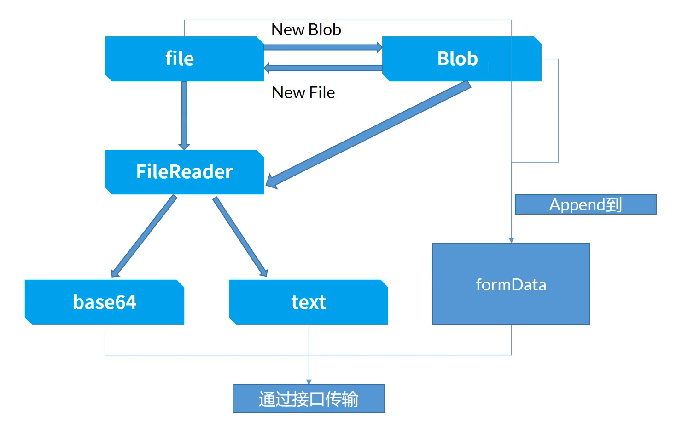

# 文件上传

文件传递给后端的两种方式：

- 二进制blob传输，FormData传输

- base64传输，转为base64传输

  会增大体积

相关对象：

- file：通过input标签读取过来的文件对象，file对象是blob的子类
- blob：不可变的二进制内容，包含很多操作方法
- FormData：用于和后端传输的对象
- fileReader：多用于把文件读取为某种形式，如base64，text文本



## 单文件上传

## 多文件上传

多文件上传是循环的单文件上传

## 大文件切片上传

```html
<input type="file" name="" id="file" multiple>
<progress id="upload_progress" value="0" max="0"></progress>
<button id="btn">上传到服务器</button>
<script>
    const ipt = document.querySelector('#file')
    const btn = document.querySelector('#btn')
    const upload_progress = document.querySelector('#upload_progress')
    let _fileObj = null

    ipt.addEventListener('change', (e) => {
        _fileObj = e.target.files[0]
        // 进度条长度
        upload_progress.max = _fileObj.size
    })

    btn.addEventListener('click', submit)

    async function submit() {
        let chunkSize = 64 * 1024
        let fileSize = _fileObj.size
        let uploadedSize = 0
        while (uploadedSize < fileSize) {
            let _formData = new FormData()
            _formData.append(_fileObj.name, _fileObj.slice(uploadedSize, uploadedSize + chunkSize))
            try {
                await axios.post('http://localhost:8000/test', _formData)
            } catch (e) {
                alert(e.message)
                return
            }
            // 更新已上传文件的大小
            uploadedSize += chunkSize
            //  更新进度条
            upload_progress.value = uploadedSize
        }
    }
</script>
<script src="https://unpkg.com/axios/dist/axios.min.js"></script>
```

## 断点续传